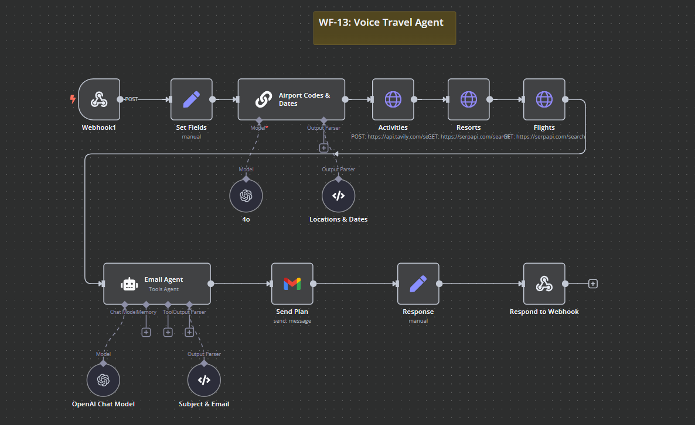

# WF-13: Voice Travel Agent – n8n Workflow

## 📌 Overview
This **n8n workflow**, `WF-13: Voice Travel Agent`, automates travel planning by processing user requests via a webhook, fetching flight and hotel details, and generating a structured travel itinerary. The finalized plan is sent via email to the user.

## 🔧 Workflow Components
### 🏗️ Core Modules
1. **🌐 Webhook** – Captures user input including origin, destination, travel dates, number of travelers, and preferred activities.
2. **📝 Set Fields** – Extracts and structures the travel details for processing.
3. **🛫 Airport Codes & Dates** – Converts city names into airport codes and validates travel dates.
4. **🌍 Flights API** – Fetches flight options based on user preferences.
5. **🏨 Resorts API** – Retrieves hotel and resort recommendations for the travel period.
6. **🎡 Activities API** – Searches for recommended activities at the destination.
7. **✉️ Email Agent** – Generates a structured travel itinerary in HTML format.
8. **📩 Gmail Node** – Sends the travel itinerary via email to the user.
9. **🔄 Response Handler** – Confirms that the email has been sent successfully.

## ⚙️ How It Works
1. 🌐 The **Webhook** captures travel details from the user, including origin, destination, dates, and activities.
2. ✈️ The **Airport Codes & Dates** node validates the dates and converts locations into airport codes.
3. 🛫 The **Flights API** fetches flight details for the requested dates.
4. 🏨 The **Resorts API** retrieves available hotel options based on user preferences.
5. 🎡 The **Activities API** fetches popular activities at the destination.
6. ✉️ The **Email Agent** compiles all the details into a well-structured HTML email.
7. 📩 The **Gmail Node** sends the final itinerary to the user's email.
8. ✅ The **Response Handler** confirms successful email delivery.

## 📷 Workflow Screenshot

## 🚀 Setup Instructions
- 📥 **Import the workflow** into `n8n`.
- 🔑 **Ensure API credentials** for OpenAI, Gmail, and travel APIs (flights, hotels, activities) are configured.
- ✅ **Activate the workflow** to start generating AI-powered travel itineraries.

## 📝 Notes
- ⚠️ The workflow is **inactive by default**.
- 🛠️ Modify API settings and email formatting to align with specific user preferences.
- 💡 Can be enhanced with **voice input integration** for seamless travel planning.

